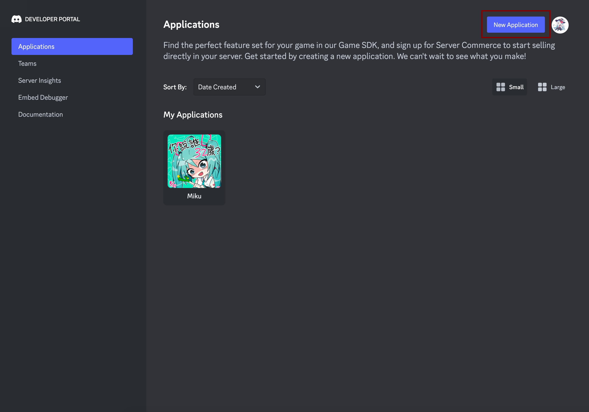
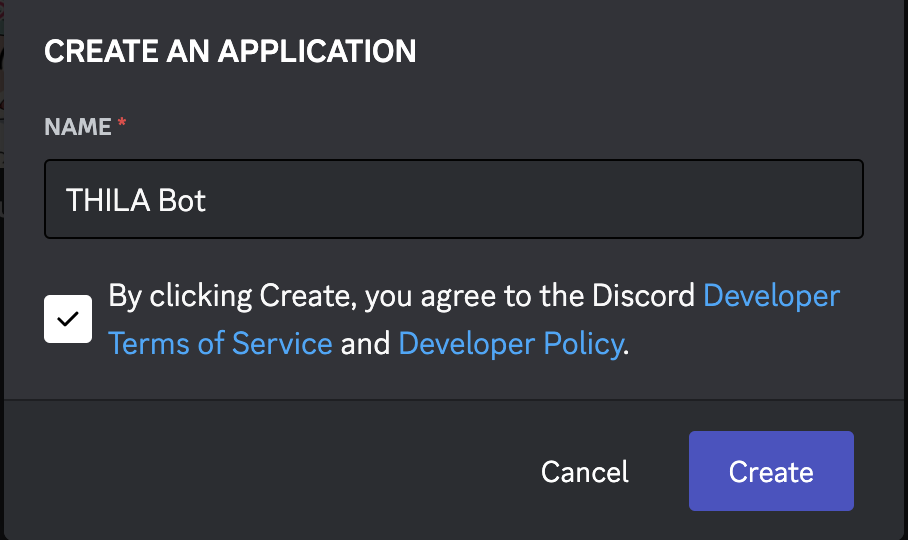
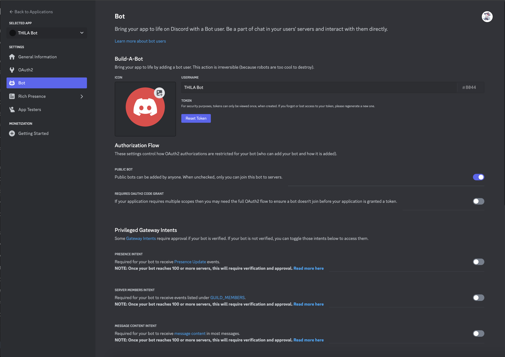
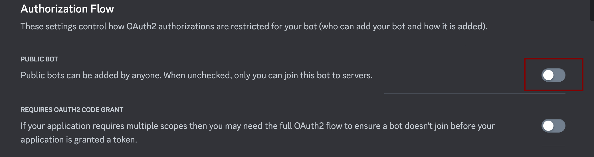
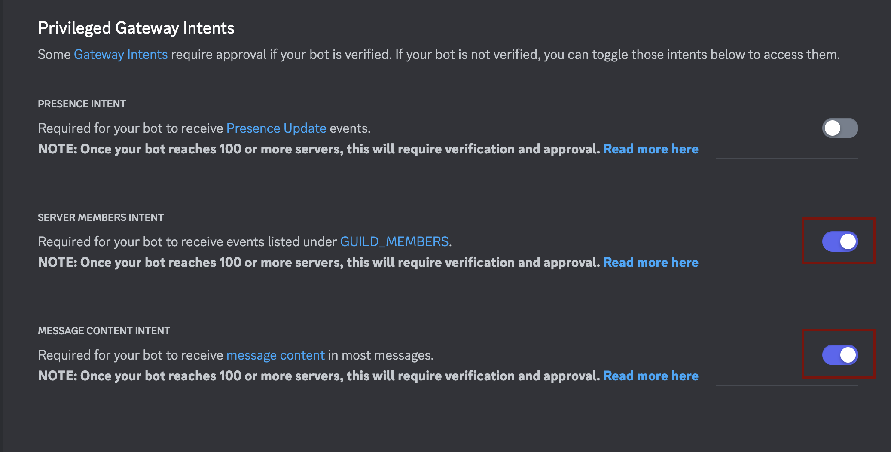
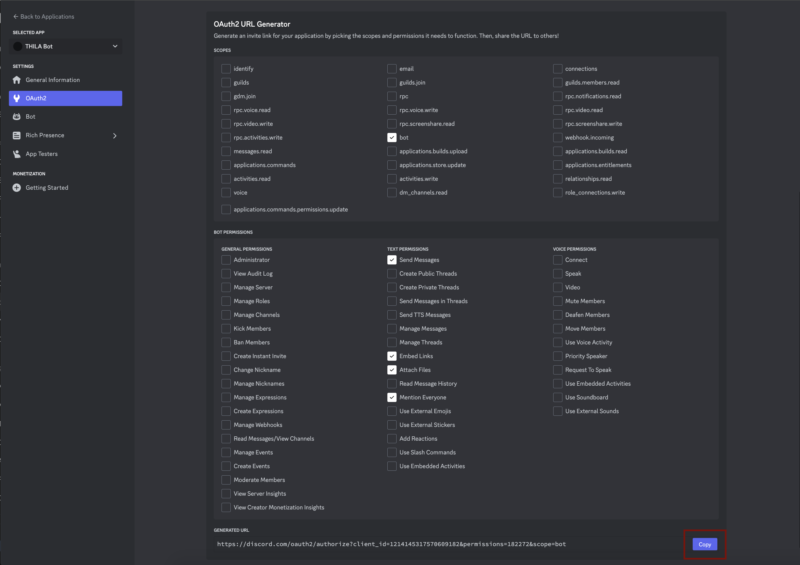

# Bot Creation
This document includes all the mandatory requirement to create a bot suitable for THILA Bot uses.

In this example we will be creating a bot named ``THILA Bot``.

First, head to [Discord Developer Portal](https://discord.com/developers/applications), and click on to the ``New Application`` on the top right to create a new discord application.

You will be prompted with a popup asking for it's name, just give it a name and proceed with it.

You will be redirected to the bot's page afterward.

Next, click on the bot tab at the left side of the page.

This is the page where you could get your token, by clicking the ``Reset Token`` button under the bot's name.

<!-- Image zoomed into reset token -->

## Authorization Flow
**Untick the Public Bot, THIS IS VERY IMPORTANT.**
Public Bot allows anyone to invite the bot to any server.
This could result in them getting access to command which they should not have in the first place, and getting the privilege to disrupt the rush evaluation process heavily.

## Priviledge Gateway Intents
The bot needs ``SERVER MEMBERS INTENT``, and ``MESSAGE CONTENT INTENT`` to function.

Gonna admit, I did not dig into this. Tried disabling them and things kinda just wouldn't work so `¯\_(ツ)_/¯`.

## Invitation
After the creation is completed, the bot will need to be invited into the server.
Go to the OAuth2 tab on the left side of the page, scroll down to the OAuth2 URL Generator, and ticks the bot scope.
Below example listed some minimum permission for the bot, but the bot will also inherit any default permission given to everyone.

And the last step would be to copy the link under the ``Generated URL``, paste it on a browser, and select a server to add the bot to.

## Server Requirement
The server should forbid member access to invoke any slash command unless except by allowed roles.
This could be achived by either
<!-- TODO: experiemtns. -->

